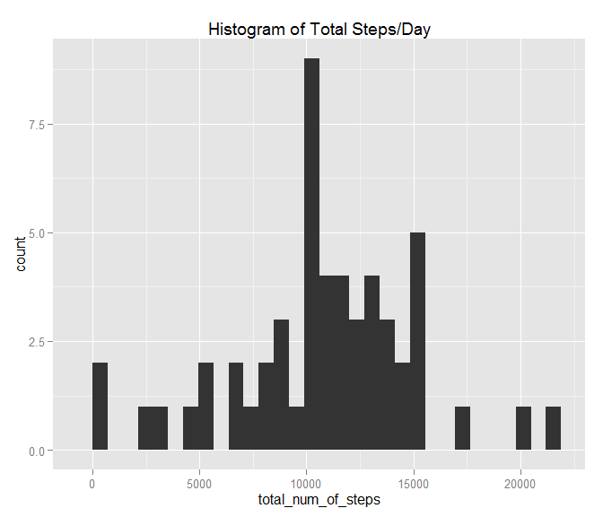
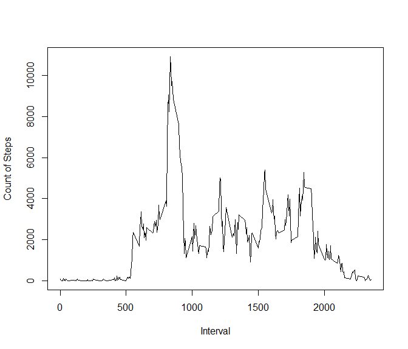
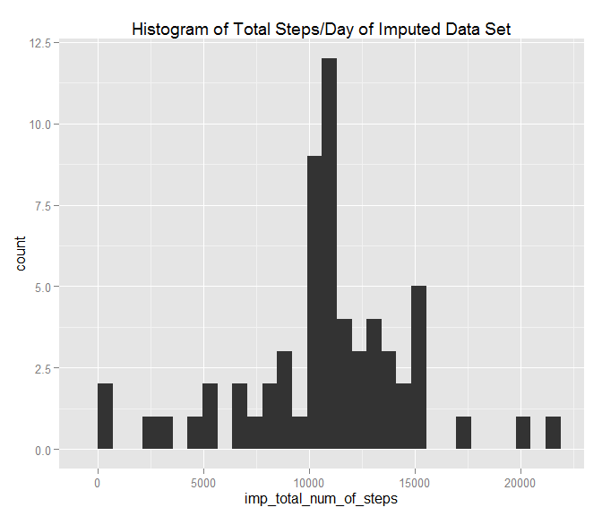
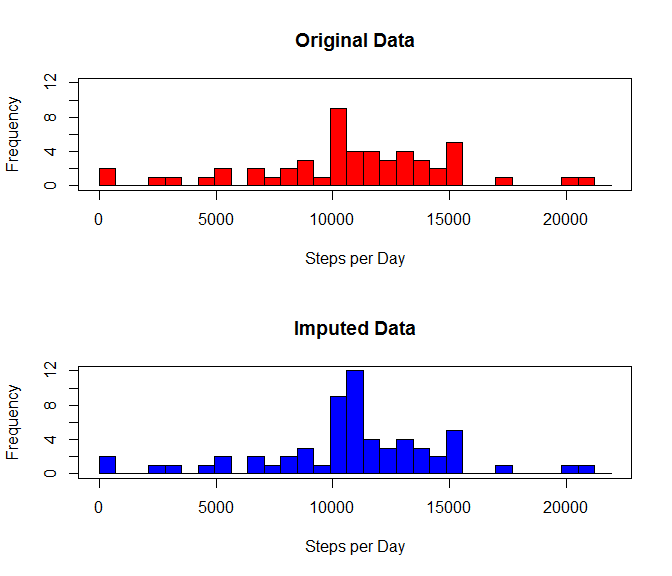
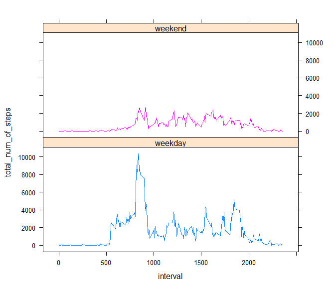

# Reproducible Research: Peer Assessment 1

## Required packages
Four R packages are required for this code: date, ggplot2, lattice and plyr.

## Loading and preprocessing the data
Load data by unzip data and load into datframe DT  
Preprocess data to make date variable a date type


```r
unzip("activity.zip")
DT <- read.csv("activity.csv", header = TRUE, na.strings= "NA")
library(date)
DT$date<-as.Date(DT$date, formats = "%m/%d/%y")
```

## What is mean total number of steps taken per day?
Create new dataframe (DT_steps_by_day) to sum the total number of steps per day by date.
Plot on a histogram using ggplot.  
Calculate mean and median.  Scientific notation is suspended (for readability) with use of "options (scipen=999)".


```r
DT_steps_by_day<-aggregate(DT$steps ~ DT$date, data=DT, sum)
colnames(DT_steps_by_day)<-c("date","total_num_of_steps")

library(ggplot2)
my_binwidth <- max(DT_steps_by_day$total_num_of_steps)/30
ggplot(DT_steps_by_day, aes(x=total_num_of_steps)) + geom_histogram(binwidth = my_binwidth) + labs(title = "Histogram of Total Steps/Day")
```

 

```r
options(scipen=999)
mean_per_day <- mean(DT_steps_by_day$total_num_of_steps, na.rm = TRUE)
mean_per_day <- round(as.numeric(mean_per_day),2)
median_per_day <- median(DT_steps_by_day$total_num_of_steps, na.rm = TRUE)
median_per_day <- round(as.numeric(median_per_day),2)
```
The mean steps per day is 10766.19.  
The median steps per day is 10765.

## What is the average daily activity pattern?
Create new dataframe (DT_steps_by_interval) to sum the total number of steps per interval.  
Plot the number of steps per interval to show daily activity pattern.  
Find the interval of max activity level.

```r
DT_steps_by_interval<-aggregate(DT$steps ~ DT$interval, data=DT, sum)
colnames(DT_steps_by_interval)<-c("interval","total_num_of_steps")

plot(DT_steps_by_interval$interval, DT_steps_by_interval$total_num_of_steps,type = "l", ylab = "Count of Steps", xlab = "Interval")
```

 

```r
sorted_DT_steps_by_interval <- order(DT_steps_by_interval$total_num_of_steps,decreasing = TRUE)
max_interval <- DT_steps_by_interval[sorted_DT_steps_by_interval,1]
max_interval <- max_interval[1]
```
The interval of average maximum activity is 835.

## Imputing missing values
A new data frame is created (impute_DT) that replaces NA values in the steps variable with the mean for that interval.  
A new data frame is created (imp_DT_steps_by_day) that sums the total number of steps per day by date.  

Result is plotted on a histogram using ggplot.

Another plot, using hist (), shows a comparison of the two histograms (original data set vs. imputed data set).  

Lastly, statistics to show the impact of the imputation method are shown.  

```r
library(plyr)
impute.mean <- function(x) replace(x, is.na(x), mean(x, na.rm = TRUE))
impute_DT <- ddply(DT, .(interval), transform, steps = impute.mean(steps))
imp_DT_steps_by_day<-aggregate(impute_DT$steps ~ impute_DT$date, data=impute_DT, sum)
colnames(imp_DT_steps_by_day)<-c("date","imp_total_num_of_steps")


ggplot(imp_DT_steps_by_day, aes(x=imp_total_num_of_steps)) + geom_histogram(binwidth = my_binwidth) + labs(title = "Histogram of Total Steps/Day of Imputed Data Set")
```

 

```r
par(mfrow = c(2, 1))
hist(DT_steps_by_day$total_num_of_steps, col = "red",ylim=c(0,12), main="Original Data", xlab="Steps per Day",breaks=seq(0,22500,by = my_binwidth))
box()
hist(imp_DT_steps_by_day$imp_total_num_of_steps, col= "blue", ylim=c(0,12), main="Imputed Data", xlab="Steps per Day", breaks=seq(0,22500,by = my_binwidth))
box()
```

 

```r
NAs <- sum(is.na(DT$steps))
total_intervals <- length(DT$interval)
percent_missing <- round(NAs/total_intervals*100,2)

imp_mean_per_day <- mean(imp_DT_steps_by_day$imp_total_num_of_steps, na.rm = TRUE)
imp_mean_per_day <- round(imp_mean_per_day,2)
imp_median_per_day <- median(imp_DT_steps_by_day$imp_total_num_of_steps, na.rm = TRUE)
imp_median_per_day <- round(imp_median_per_day,2)

mean_diff <- mean_per_day - imp_mean_per_day
median_diff <- median_per_day - imp_median_per_day
```


Number of intervals with no measurements: 2304  
Total number of intervals: 17568  
Percentage of missing measurements: 13.11%  
  
The mean steps per day of the imputed data set is 10766.19.  
By imputing the data to the mean of the interval, it changed the mean steps per day by: 0  

The median steps per day of the imputed data set is 10766.19.  
By imputing the data to the mean of the interval, it changed the median steps per day by: -1.19  

## Are there differences in activity patterns between weekdays and weekends?  
The a new variable (is_weekday) is created in the original data frame (DT) to denote whether a given interval occurred on a weekday (Monday - Friday) or weekend (Saturday or Sunday)

The NA measurements in the steps value are again replaced using the above approach (NA values in the steps variable are replaced with the with the mean for that interval).  The data is then aggregated by interval.

Using lattice plot, a plot is shown that directly compares the activity patterns betwen weekdays and weekends.


```r
DT$is_weekday <- weekdays(as.Date(DT$date))
DT$is_weekday[DT$is_weekday == "Saturday" | DT$is_weekday == "Sunday"] <- "weekend"
DT$is_weekday[DT$is_weekday != "weekend" ] <- "weekday"
DT$is_weekday<-as.factor(DT$is_weekday)

impute.mean <- function(x) replace(x, is.na(x), mean(x, na.rm = TRUE))
impute_DT <- ddply(DT, .(interval), transform, steps = impute.mean(steps))

impute_DT_steps_by_interval <-aggregate(impute_DT$steps ~ impute_DT$interval + impute_DT$is_weekday, data=DT, sum)
colnames(impute_DT_steps_by_interval)<-c("interval","is_weekday", "total_num_of_steps")

library(lattice) 
xyplot(total_num_of_steps~interval | is_weekday, data = impute_DT_steps_by_interval, type = "l", groups = is_weekday,layout=c(1,2))
```

 

